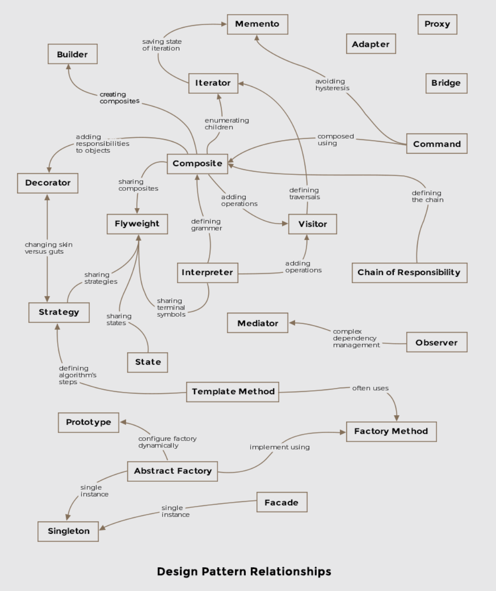

# Software Design Pattern

Tech problems sometimes have well-defined solutions, they are flexible, modular and more understandable. Design patterns are abstracted solutions which ignore the technical details.

### Types of Design Patterns

+ [Creational](./creational/README.md)
    * [**Builder**](./creational/builder-pattern.md)
    * **Prototype**
    * **Singleton**
    * **Abstract Factory**

+ [Structural](./structural/README.md)
    * Adapter
    * Bridge
    * Composite
    * **Decorator**
    * Facade
    * Flyweight
    * **Proxy**

+ [Behavioral](./behavioral/README.md)
    * Interpreter
    * Template
    * Chain of Responsibility
    * Command
    * **Iterator**
    * Mediator
    * Memento
    * **Observer**
    * State
    * Strategy
    * **Visitor**

### General Guidelines for OOD

+ Separate out parts of code that are reusable

+ Always code to an interface and not against a concrete implementation

+ Encapsulate behaviors as much as possible

+ Favor composition over inheritance. *Inheritance can result in explosion of classes and also sometimes the base class is fitted with new functionality that isn't applicable to some of its derived classes*

+ Interacting components within a system should be as loosely coupled as possible

+ Ideally, class design should inhibit modification and encourage extension

+ Using patterns in daily work, allows exchanging entire implementation concepts with other developers via shared pattern vocabulary

# Reference

[1] "Software Design Pattern: Best Practices for Software Developer" by educative.io

[2] Design Patterns by refactoring.guru
