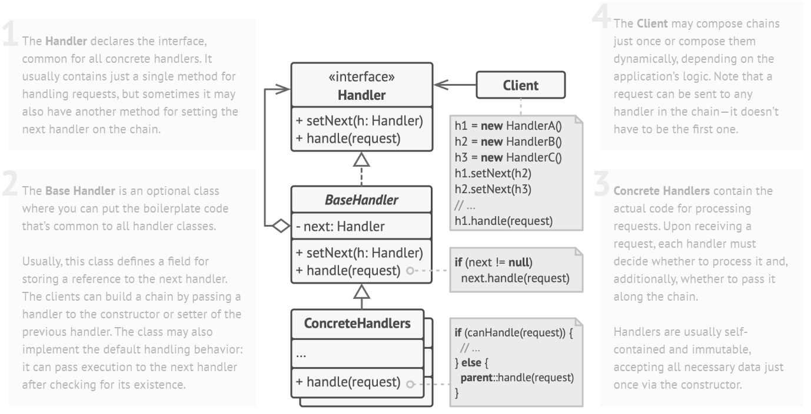

# Chain Of Responsibility Design Pattern

> This decouples the sender of a request from its receiver by chaining the receiving objects together and passing the request along the chain until an object handles it

## Problem

In an online ordering system, the authentication checks are in sequence:
+ adding/changing one check may affect others
+ reusing some checks may need a duplicate

## Solution

Each check are transformed into a handler which share a common interface:
+ contains a strong reference to the next handler
+ contains the code to handle the request
