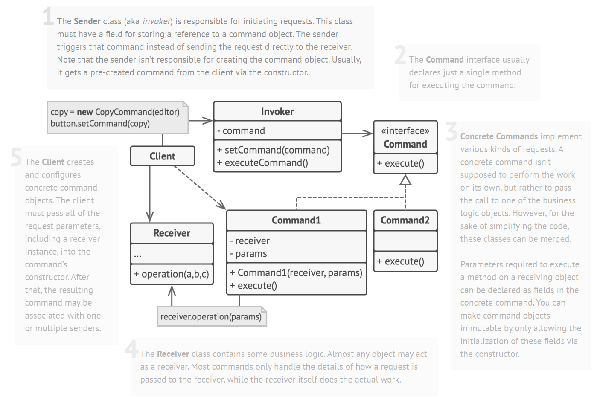

# Command Design Pattern

> Command pattern represents an action or a request as an object, that can then be passed to other objects as parameters, allowing parameterization of clients with requests or actions.

The requests can be queued for later execution or logged.

## Problem

When designing a toolbar UI interface, it may need different kinds of buttons, e.g. `OKButton`, `SaveButton`, etc. The simplest solution is to create tons of subclasses for different buttons.
+ this would make the UI code depend on the volatile code of business logic
+ cannot reuse of some operation code like copy/paste in other places

## Solution

