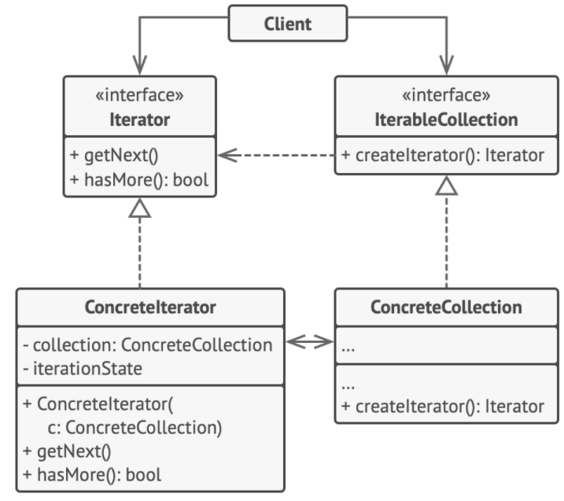

# Iterator Pattern

> Iterator is pattern that allows traversing the elements of an aggregate or a collection sequentially without exposing the underlying implementation.

+ External Iterator
    * client controls advancing the traversal and explicitly requesting the next element from iterator
+ Internal Iterator
    * client hands the iterator an operation to perform, and the iterator performs the operation on each element of aggregate

A collection can be:
+ list
+ array
+ arraylist
+ hashmap
+ ...

## Problem

+ may need many different traversal algorithms
+ some traversal algorithm may be tailored for a specific usage
+ client doesn't care how the collection store its elements

## Solution



#### Iterator

Interface declares the required operations: fetching the next element, retrieving the current position, restarting the iteration, etc.

```c++

```

#### Concrete Iterator

Implement specific algorithms for traversing a collection.

```c++
template <typename T, typename U>
class Iterator {
private:
    U* m_p_data_;
    iter_type m_it_;

public:
    typedef typename std::vector<T>::iterator iter_type;

    Iterator(U* p_data, bool reverse = false) : m_p_data_(p_data) {
        m_it_ = m_p_data_->m_data_.begin();
    }

    void first() {
        m_it_ = m_p_data_->m_data_.begin();
    }

    void next() {
        m_it_++;
    }

    bool isDone() {
        return (m_it_ == m_p_data_->m_data_.end());
    }

    iter_type current() {
        return m_it_;
    }
};
```

#### Aggregate

Interface declares one or multiple methods for getting iterators compatible with the collection.

```c++

```

#### Concrete Aggregate

Return new instances of a particular concrete iterator class each time the client requests one.

```c++
template <class T>
class Container {
    friend class Iterator<T, Container>;

private:
    std::vector<T> m_data_;

public:
    void add(T a) {
        m_data_.push_back(a);
    }

    Iterator<T, Container>* createIterator() {
        return new Iterator<T, Container>(this);
    }
};
```

#### Client

```c++
class Data {
private:
    int m_data_;

public:
    Data(int a = 0) : m_data_(a) {}

    void setData(int a) {
        m_data_ = a;
    }

    int getData() {
        return m_data_;
    }
};

void clientCode() {
    // int type
    Container<int> cont;
    for (int i = 0; i < 10; i++) {
        cont.add(i);
    }
    Iterator<int, Container<int>> *it = cont.createIterator();
    for (it->first(); !it->isDone(); it->next()) {
        std::cout << *it->current() << std::endl;
    }

    // custom data type
    Container<Data> cont2;
    Data a(100), b(200), c(300);
    cont2.add(a);
    cont2.add(b);
    cont2.add(c);
    Iterator<Data, Container<Data>> *it2 = cont2.createIterator();
    for (it2->first(); !it2->isDone(); it2->next()) {
        std::cout << *it->current()->getData() << std::endl;
    }

    delete it;
    delete it2;
}
```

## Caveats

+ There could be *more than one* pending traversals on the aggregate. Each iterator would store its own traversal state, e.g. using *memento* pattern.
