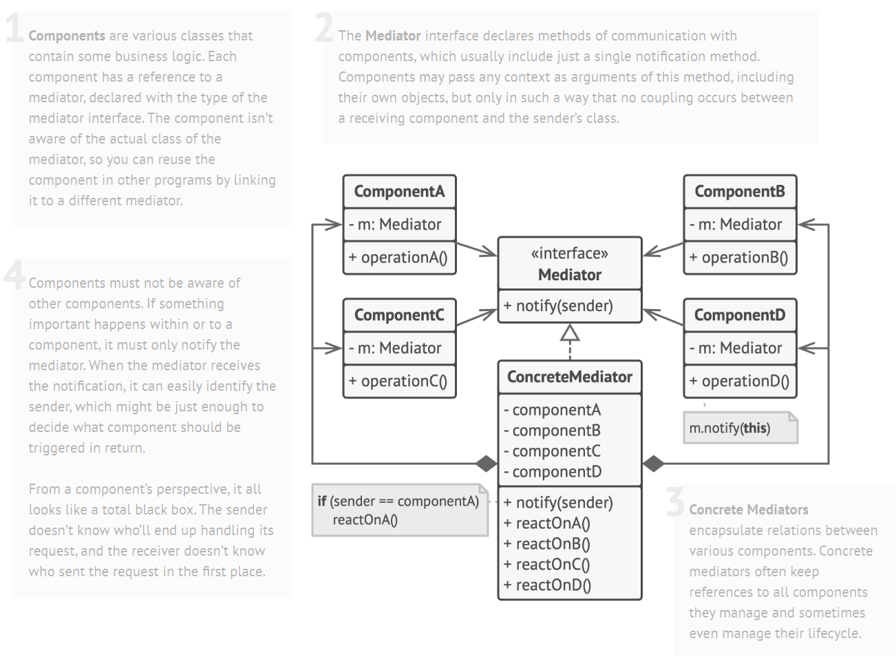

# Mediator Design Pattern

> Mediator pattern encourages loose coupling among interacting objects by encapsulating their interactions in a mediator object, thus avoiding the need for individual objects to refer to each other directly and allowing to vary object interactions independently

## Solution

