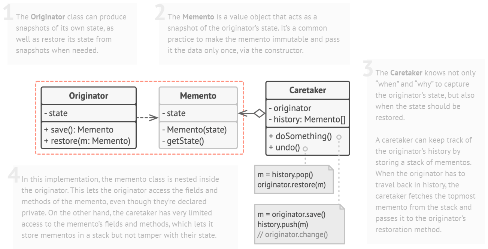
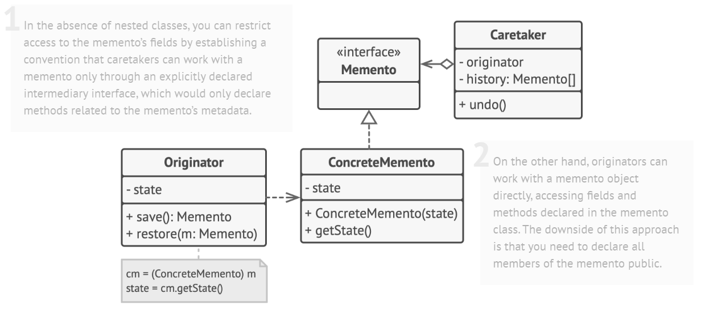
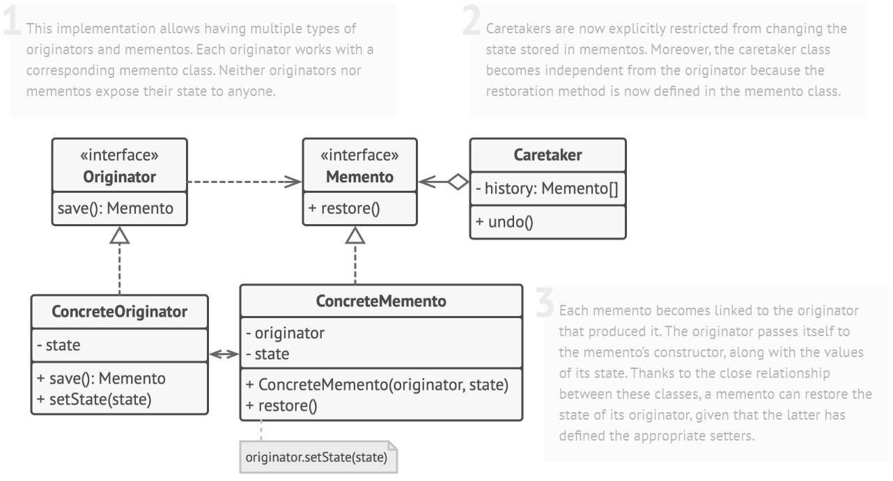

# Memento Design Pattern

> Memento pattern captures the internal state of an object without exposing its internal structure so that the object can be restored to this state later.

## Solution

1. Implementation based on nested classes

2. Implementation based on an intermediate interface

3. Implementation with even stricter encapsulation

