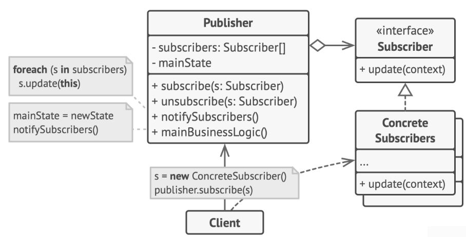

# Observer Pattern

> The pattern is one to many dependency between objects so that when one object changes state all the dependents are notified.

## Problems

+ customer wastes time checking product availability
+ store wastes resources notifying the wrong customers

## Solution



#### Subject

```c++
class ISubject {
public:
    virtual ~ISubject(){};
    virtual void attach(IObserver *observer) = 0;
    virtual void detach(IObserver *observer) = 0;
    virtual void notify() = 0;
};
```

#### Observer

```c++
class IObserver {
public:
    virtual ~IObserver(){};
    virtual void update(const std::string &msg_from_subject) = 0;
};
```

#### Concrete Subject

```c++
class Subject : public ISubject {
private:
    std::list<IObserver*> list_observer_;
    std::string message_;

public:
    virtual ~Subject() {}
    void attach(IObserver *observer) override {
        list_observer_.push_back(observer);
    }
    void detach(IObserver *observer) override {
        list_observer_.remove(observer);
    }
    void notify() override {
        std::list<IObserver*>::iterator it = list_observer_.begin();
        howManyObserver();
        while (it != list_observer_.end()) {
            (*it)->update(message_);
            ++it;
        }
    }

    void createMsg(std::string msg = "empty") {
        this->message_ = msg;
        notify();
    }
    void howManyObserver() {
        std::cout << "there are " << list_observer_.size() << " observers" << std::endl;
    }
    void someBusinessLogic() {
        this->message_ = "change message";
        notify();
    }
};
```

#### Concrete Observer

```c++
int Observer::static_number_ = 0;

class Observer : public IObserver {
private:
    std::string msg_from_subject_;
    Subject &subject_;
    static int static_number_;
    int number_;

public:
    Observer(Subject &subject) : subject_(subject) {
        this->subject_.attach(this);
        std::cout << "I am the Observer No." << ++Observer::static_number_ << std::endl;
        this->number_ = Observer::static_number_;
    }
    virtual ~Observer() {
        std::cout << "Goodbye, I was Observer No." << this->number_ << std::endl;
    }

    void update(const std::string &msg_from_subject) override {
        msg_from_subject_ = msg_from_subject;
        printInfo();
    }

    void removeMeFromList() {
        subject_.detach(this);
        std::cout << "Observer No." << this->number_ << " is removed from list" << std::endl;
    }
    void printInfo() {
        std::cout << "Observer No." << this->number_ << " get a new message: " << this->msg_from_subject_ << std::endl;
    }
};
```

#### Client Code

```c++
void clientCode() {
    Subject *subject = new Subject();
    Observer *ob1 = new Observer(*subject);
    Observer *ob2 = new Observer(*subject);
    Observer *ob3;

    subject->createMsg("hello");
    ob2->removeMeFromList();

    ob3 = new Observer(*subject);
    subject->createMsg("bye");

    ob3->removeMeFromList();
    ob1->removeMeFromList();

    delete ob1;
    delete ob2;
    delete ob3;
    delete subject;
}
```

## Caveats

+ another entity *Change Manager* can sit between the observers and the subject when the dependencies are complex

+ in case of many subjects and few observers, if each subject stores its observers separately, it will increase the storage costs

+ A small change in the subject can overwhelm the observers with updates, where we can batch the changes and the invoke notify on the subject
