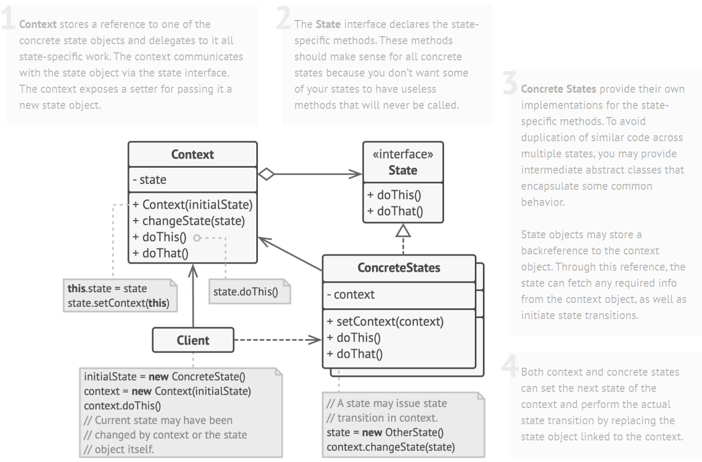

# State Design Pattern

> State pattern allows an object to alter behavior when its internal state changes so that it appears to change its class.

## Solution



#### Context

```c++
class Context {
private:
    State *state_;

public:
    Context(State *state) : state_(nullptr) {
        this->transitionTo(state);
    }
    ~Context() {
        delete state_;
    }

    void transitionTo(State *state) {
        std::cout << "Context: transition to " << typeid(*state).name() << "\n" << std::endl;
        if (this->state_ != nullptr) {
            delete this->state_;
        }
        this->state_ = state;
        this->state_->setContext(this);
    }
    void request1() {
        this->state_->handle1();
    }
    void request2() {
        this->state_->handle2();
    }
};
```

#### State Interface

```c++
class State {
protected:
    Context *context_;

public:
    virtual ~State() {}
    void setContext(Context *context) {
        this->context_ = context;
    }
    virtual void handle1() = 0;
    virtual void handle2() = 0;
};
```

#### Concrete State

```c++
class ConcreteStateA : public State {
public:
    void handle1() override {
        std::cout << "ConcreteStateA handles request1" << std::endl;
        std::cout << "ConcreteStateA transitions to B" << std::endl;
        this->context_->transitionTo(new ConcreteStateB);
    }
    void handle2() override {
        std::cout << "ConcreteStateA handles request2" << std::endl;
    }
};

class ConcreteStateB : public State {
public:
    void handle1() override {
        std::cout << "ConcreteStateB handles request1" << std::endl;
    }
    void handle2() override {
        std::cout << "ConcreteStateB handles request2" << std::endl;
        std::cout << "ConcreteStateB transitions to A" << std::endl;
        this->context_->transitionTo(new ConcreteStateA);
    }
};
```

#### Client Code

```c++
void clientCode() {
    Context *context = new Context(new ConcreteStateA);
    // A handles request1 and transitions to B
    context->request1();
    // B handles request2 and transitions to A
    context->request2();
    delete context;
}
```
