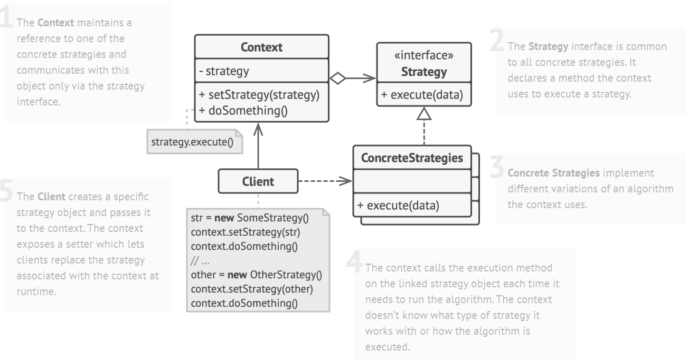

# Strategy Design Pattern

> Strategy pattern encapsulates algorithms belonging to the same family and making them interchangeable. The consumers of the common interface that the algorithms implement allow switching out one algorithm for another seamlessly.

## Solution

