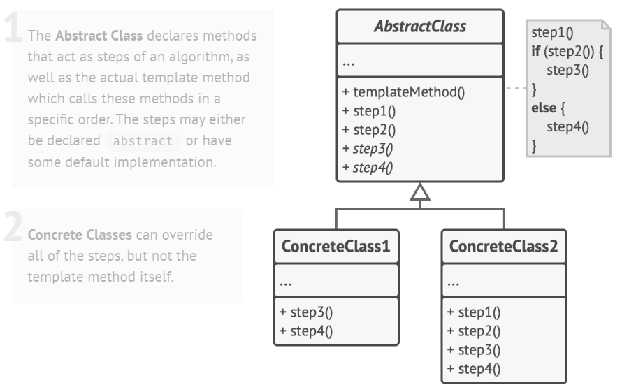

# Template Design Pattern

> Template pattern allows subclasses to define parts of an algorithm without modifying the overall structure of the algorithm.

A **template method** defines an algorithm in terms of abstract operations that subclasses override to provide concrete behavior.

## Solution

