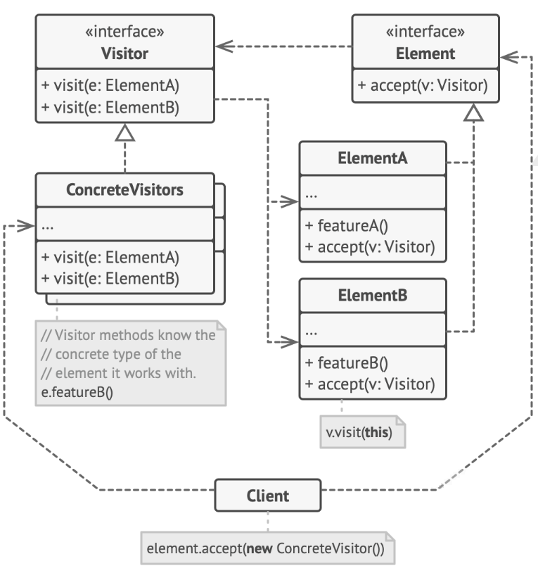

# Visitor Pattern

> The pattern defines operations to be performed on elements of an object structure without changing the classes of the elements it works on.

## Problem

+ it is not allowed to alter the existing classes
+ many new requests may comes in to make the alteration of existing classes even more inconvenient

## Solution

+ Place the new behavior into a separate class `Visitor`, instead of integrating it into the existing class
+ The object that to perform the behavior is now passed to one of the `Visitor` methods as an argument



#### Visitor

Declare a set of `visit()` methods that can take concrete `Element` of an object structure as arguments.

```c++
class Visitor {
public:
    virtual void visitConcreteElementA(const ConcreteElementA *element) const = 0;
    virtual void visitConcreteElementB(const ConcreteElementB *element) const = 0;
};
```

#### Concrete Visitor

```c++
class ConcreteVisitor1 : public Visitor {
public:
    void visitConcreteElementA(const ConcreteElementA *element) const override {
        std::cout << element->printConcreteElementA() << " + ConcreteVisitor1\n";
    }
    void visitConcreteElementB(const ConcreteElementB *element) const override {
        std::cout << element->printConcreteElementB() << " + ConcreteVisitor1\n";
    }
};

class ConcreteVisitor2 : public Visitor {
public:
    void visitConcreteElementA(const ConcreteElementA *element) const override {
        std::cout << element->printConcreteElementA() << " + ConcreteVisitor2\n";
    }
    void visitConcreteElementB(const ConcreteElementB *element) const override {
        std::cout << element->printConcreteElementB() << " + ConcreteVisitor2\n";
    }
};
```

#### Element

Declare an `accept()` method with the type of the `Visitor` interface as one argument.

```c++
class Element {
public:
    virtual ~Element() {}
    virtual void accept(Visitor *visitor) const = 0;
};
```

#### Concrete Element

Implement the `accept()` method to redirect the call to the proper `Visitor` method corresponding to the current `Element` class.

```c++
class ConcreteElementA : public Element {
public:
    void accept(Visitor *visitor) const override {
        visitor->visitConcreteElementA(this);
    }
    std::string printConcreteElementA() const {
        return "A";
    }
};

class ConcreteElementB : public Element {
public:
    void accept(Visitor *visitor) const override {
        visitor->visitConcreteElementB(this);
    }
    std::string printConcreteElementB() const {
        return "B";
    }
};
```

#### Client Code

```c++
void clientCode(std::array<const Element*, 2> elements, Visitor *visitor) {
    for (const Element *elem : elements) {
        elem->accept(visitor);
    }
}

int main() {
    std::array<const Element*, 2> elements = {new ConcreteElementA, new ConcreteElementB};
    ConcreteVisitor1 *visitor1 = new ConcreteVisitor1;
    clientCode(elements, visitor1);
    ConcreteVisitor2 *visitor2 = new ConcreteVisitor2;
    clientCode(elements, visitor2);

    for (const Element* elem : elements) {
        delete elem;
    }
    delete visitor1;
    delete visitor2;
    return 0;
}
```

## Caveats

+ visitor pattern is not ideal when new concrete element classes are added frequently. If the `Element` class is stable, but adding operations or changing algorithms are often, visitor pattern is good

+ an iterator requires that a composite be made up of elements with the same base class or interface, but a visitor can visit all elements of a composite even if they are unrelated

+ adding new concrete classes will require modifying all the visitor classes, which makes it hard to add new type to the object structure
