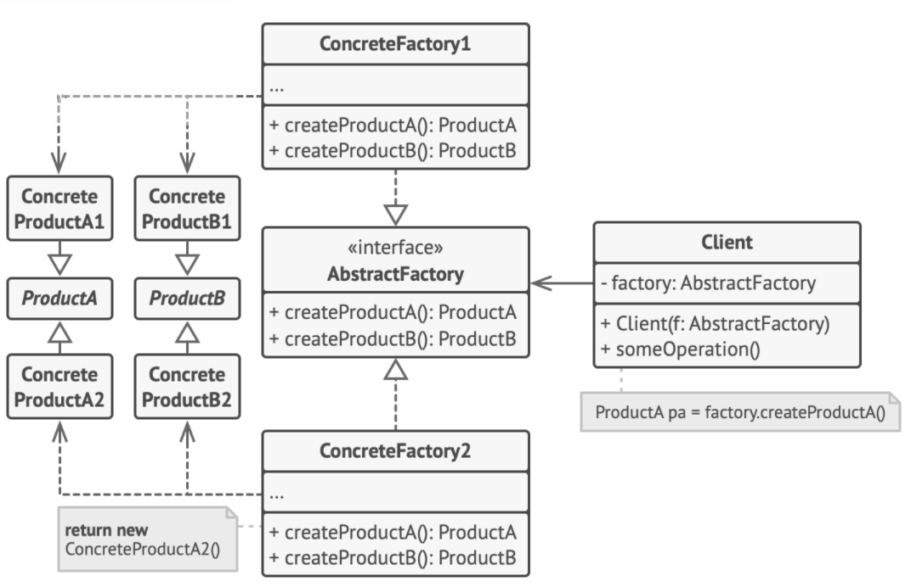

# Abstract Factory Pattern

> Define an interface to create families of related or dependent objects without specifying their concrete classes.

## Problem

Your code consists of classes that represent:
1. a family of related products, e.g. `Chair` + `Sofa` + `Table`
2. several variants of the family, e.g. `Modern`, `ArtDeco`, etc.

If vendors update their catalog very often, adding new products or families of products, it could be a hassle to change existing code.

## Solution



#### Abstract Product

Explicitly declare interfaces for each distinct product of the product family, e.g. `Chair`, `Sofa`, etc.

```c++
class AbstractProductA {
public:
    virtual ~AbstractProductA() {};
    virtual std::string func1A() const = 0;
};

class AbstractProductB {
public:
    virtual ~AbstractProductB() {};
    virtual std::string func1B() const = 0;
    virtual std::string func2B(const AbstractProductA &collaborator) const = 0;
};
```

#### Concrete Product

Make all variants of products follow the abstract product interfaces, e.g. all chair variants implement the `Chair` interface.

```c++
class ConcreteProductA1 : public AbstractProductA {
public:
    std::string func1A() const override {
        return "product A1";
    }
};

class ConcreteProductA2 : public AbstractProductA {
public:
    std::string func1A() const override {
        return "product A2";
    }
};

class ConcreteProductB1 : public AbstractProductB {
public:
    std::string func1B() const override {
        return "product B1";
    }
    // B1 only works with A1 variant, but here to accept any instance of AbstractProductA
    std::string func2B(const AbstractProductA &collaborator) const override {
        const std::string result = collaborator.func1A();
        return "product B1 collaborating with " + result;
    }
};

class ConcreteProductB2 : public AbstractProductB {
public:
    std::string func1B() const override {
        return "product B2";
    }
    // B2 only works with A2 variant, but here to accept any instance of AbstractProductA
    std::string func2B(const AbstractProductA &collaborator) const override {
        const std::string result = collaborator.func1A();
        return "product B2 collaborating with " + result;
    }
};
```

#### Abstract Factory

Declare abstract factory interface with a list of certain methods for all products that are part of the product family, e.g. `createChair`, `createSofa`. These methods must return **abstract** product types, i.e. `Chair`, `Sofa`, etc.

```c++
class AbstractFactory {
public:
    virtual AbstractProductA* createProductA() const = 0;
    virtual AbstractProductB* createProductB() const = 0;
};
```

#### Concrete Factory

For each variant of a product family, create a separate factory class based on the abstract factory interface. For example, `ModernFurnitureFactory` only creates `ModernChair`, `ModernSofa`, etc.

> Can be best represented as a **singleton** object.

```c++
class ConcreteFactory1 : public AbstractFactory {
public:
    AbstractProductA* createProductA() const override {
        return new ConcreteProductA1();
    }
    AbstractProductB* createProductB() const override {
        return new ConcreteProductB1();
    }
};

class ConcreteFactory2 : public AbstractFactory {
public:
    AbstractProductA* createProductA() const override {
        return new ConcreteProductA2();
    }
    AbstractProductB* createProductB() const override {
        return new ConcreteProductB2();
    }
};
```

#### Client

```c++
void clientCode(const AbstractFactory& factory) {
    const AbstractProductA *product_a = factory.createProductA();
    const AbstractProductB *product_b = factory.createProductB();
    product_b->func1B();
    product_b->func2B(*product_a);
    delete product_a;
    delete product_b;
}
```

#### Main

```c++
int main() {
    // test factory type 1
    ConcreteFactory1 *f1 = new ConcreteFactory1();
    clientCode(*f1);
    delete f1;
    // test factory type 2
    ConcreteFactory2 *f2 = new ConcreteFactory2();
    clientCode(*f2);
    delete f2;
    return 0;
}
```

## Caveats

Factory method pattern and abstract factory pattern look similar, but:
+ Factory method pattern
    * is usually responsible for creating a *single product*
    * uses inheritance to create more specialized products
+ Abstract factory pattern
    * creates *entire families of related products*
    * composes object by passing in factories that are consumed to create the desired products
