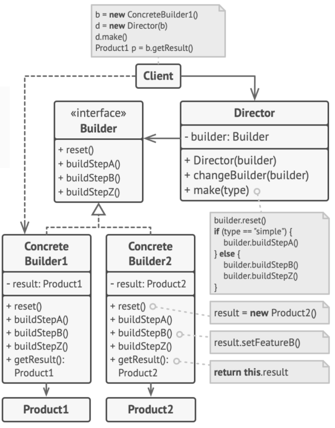

# Builder Pattern

The exercise of creating a *composite* or an *aggregate* object can be simplified by using the builder pattern, i.e. **creating an object with lots of possible configuration options.**

> A builder pattern encapsulates or hides the process of building a complex object, and separates the representation of the object and its construction. The separation allows us to construct different representations using the same construction process.

## Problem

Creating a `House` object with many different configurations (garage, swimming pool, garden, etc.):

+ extend the base `House` class, create a set of subclasses to cover all configs
    * too many subclasses
    * any new parameter requires to grwo the subclass hierachy
+ create a giant constructor in the base `House` class
    * most of parameters will be unused, the constructor calls could be ugly with `null` or `false`, etc.

## Solution



#### Product

A `Builder` instance should contain a `Product` object to be used in further assembly.

```c++
class Product1 {
public:
    std::vector<std::string> parts;
    void listParts() const {
        // print out parts
    }
};
```

#### Builder

Extract the object construction code out of its own class and move it to separate objects called `Builder`.

```c++
class Builder {
public:
    virtual ~Builder() {}
    virtual void producePartA() const = 0;
    virtual void producePartB() const = 0;
    virtual void producePartC() const = 0;
};
```

#### Concrete Builder

Follow the `Builder` interface and provide specific implementation of the building steps.

```c++
class ConcreteBuilder1 : public Builder {
private:
    Product1* product;

public:
    ConcreteBuilder1() {
        this->reset();
    }
    ~ConcreteBuilder1() {
        delete product;
    }
    void reset() {
        this->product = new Product1();
    }
    void producePartA() const override {
        this->product->parts.push_back("PartA1");
    }
    void producePartB() const override {
        this->product->parts.push_back("PartB1");
    }
    void producePartC() const override {
        this->product->parts.push_back("PartC1");
    }

    // the product ownership is transferred to the client, user needs to release the memory
    Product1* getProduct() {
        Product1* result = this->product;
        // builder instance is ready to start producing another product by using reset()
        this->reset();
        return result;
    }
};
```

#### Director

Optionally further extract a series of calls to the builder steps used to construct a product into a separate class called `Director`.

```c++
class Director {
private:
    Builder* builder;

public:
    void setBuilder(Builder* builder) {
        this->builder = builder;
    }
    void buildMinimalProduct() {
        this->builder->producePartA();
    }
    void buildFullProduct() {
        this->builder->producePartA();
        this->builder->producePartB();
    }
};
```

#### Client

```c++
void clientCode(Director& director) {
    ConcreteBuilder1* builder = new ConcreteBuilder1();
    director->setBuilder(builder);

    // create a minimal product
    director->buildMinimalProduct();
    Product1* pMini = builder->getProduct();
    pMini->listParts();
    delete pMini;

    // create a full product
    director->buildFullProduct();
    Product1* pFull = builder->getProduct();
    pFull->listParts();
    delete pFull;

    // create a custom product without Director
    builder->producePartA();
    builder->producePartC();
    Product1* pCustom = builder->getProduct();
    pCustom->listParts();
    delete pCustom;

    delete builder;

    return;
}
```

#### Main

```c++
int main() {
    Director* director = new Director();
    clientCode(*director);
    delete director;
    return 0;
}
```

## Caveats

Builder pattern seems similar to the abstract factory pattern, but:
+ builder pattern creates an object step by step
+ abstract factory pattern returns the object in one go
