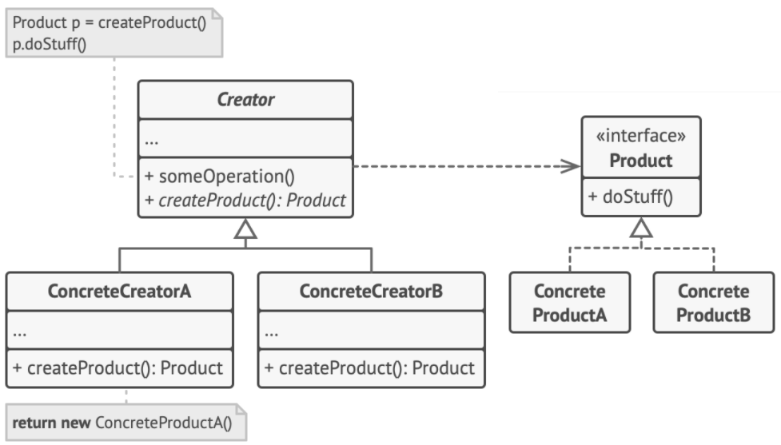

# Factory Pattern

> Factory method provides an interface for object creation but delegates the actual instantiation of objects to subclasses.

## Problem

There is nothing wrong with the object creation using `MyClass myObj = new MyClass();`. But the object is tightly coupled to the concrete implementation class, which is a violation of *code to an interface and not to an implementation*.

## Solution



#### Product

`Product` **interface** is common to all objects that can be produced by the `Creator` and its subclasses.

```c++
class Product {
public:
    virtual ~Product() {}
    virtual std::string operation() const = 0;
};
```

#### Concrete Product

Difference implementations of the `Product` interface.

```c++
class ConcreteProduct1 : public Product {
public:
    std::string operation() const override {
        return "Result of ConcreteProduct1";
    }
};

class ConcreteProduct2 : public Product {
public:
    std::string operation() const override {
        return "Result of ConcreteProduct2";
    }
};
```

#### Creator

`Creator` **class** declares the factory method that returns new `Product` objects. But the primary responsibility is not creating objects. It contains some core logic that relies on the `Product` objects.

```c++
class Creator {
public:
    virtual ~Creator() {}
    virtual Product* factoryMethod() const = 0;

    std::string someOperation() const {
        Product* product = this->factoryMethod();
        std::string result = "Creator: same creator's code has just worked with " + product->operation();
        delete product;
        return result;
    }
};
```

#### Concrete Creator

Override the base factory method so it returns a different type of `Product`.

```c++
class ConcreteCreator1 : public Creator {
public:
    Product* factoryMethod() const override {
        return new ConcreteProduct1();
    }
};

class ConcreteCreator2 : public Creator {
public:
    Product* factoryMethod() const override {
        return new ConcreteProduct2();
    }
};
```

#### Client

```c++
void clientCode(const Creator& creator) {
    std::cout << "Client: I'm not aware of the creator's class, but it still works.\n" << creator->someOperation() << std::endl;
}
```

#### Main

```c++
int main() {
    Creator* c1 = new ConcreteCreator1();
    clientCode(*c1);
    Creator* c2 = new ConcreteCreator2();
    clientCode(*c2);
    delete c1;
    delete c2;
    return 0;
}
```

## Caveats

+ Factory pattern can result in too many subclasses with very minor differences
+ If the subclass extends the functionality, the superclass can't use it unless it downcasts it to the concrete type. The downcast may fail at runtime
