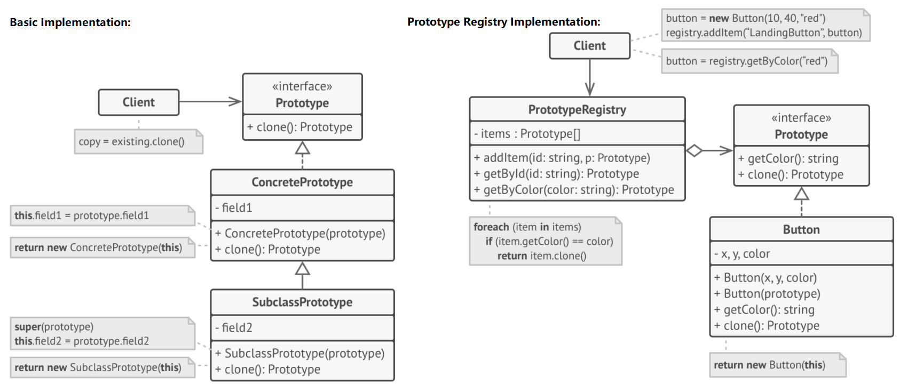

# Prototype Pattern

> Specify the kind of objects to create using a prototypical instance as a model and making copies of the prototype to create new objects.

Motivations:
+ somtimes creating new objects is more expensive than copying existing objects
+ a class will only be loaded at runtime and you can't access its constructor statically
+ the number of classes in a system can be greatly reduced by varying the values of a cloned object from a prototypical instance

## Problem

+ not all objects can be copied because some fields may be private
+ have to know the object's class to duplicate, which increases the dependency
+ when only knowing the interface that object follows, not its concrete class

## Solution

Delegate the cloning process to the actual objects that are being cloned.



#### Prototype

A common prototype interface for all objects that support cloning, allowing client code not to couple with the class of cloned object.

```c++
class Prototype {
protected:
    std::string name_;
    float field_;

public:
    Prototype() {}
    Prototype(std::string name) : name_(name) {}
    virtual ~Prototype() {}
    virtual Prototype* clone() const = 0;
    virtual void func(float field) {
        this->field_ = field;
        std::cout << "calling func() from " << name_ << " with field=" << field_ << std::endl;
    }
};
```

#### Concrete Prototype

```c++
// this example has all data member in the stack
// if having pointers data member, make sure to have a deep copy in the clone
class ConcretePrototype1 : public Prototype {
private:
    float field1_;

public:
    ConcretePrototype1(std::string name, float field) : Prototype(name), field1_(field) {}
    // client has responsibility to free this memory later
    Prototype* clone() const override {
        return new ConcretePrototype1(*this);
    }
};

class ConcretePrototype2 : public Prototype {
private:
    float field2_;

public:
    ConcretePrototype2(std::string name, float field) : Prototype(name), field2_(field) {}
    Prototype* clone() const override {
        return new ConcretePrototype2(*this);
    }
};
```

#### Prototype Factory

```c++
enum PrototypeType {
    PROTOTYPE_1 = 0,
    PROTOTYPE_2
};

class PrototypeFactory {
private:
    std::unordered_map<PrototypeType, Prototype*, std::hash<int>> prototypes_;

public:
    PrototypeFactory() {
        prototypes_[PrototypeType::PROTOTYPE_1] = new ConcretePrototype1("PROTOTYPE_1 ", 50.f);
        prototypes_[PrototypeType::PROTOTYPE_2] = new ConcretePrototype2("PROTOTYPE_2 ", 60.f);
    }
    ~PrototypeFactory() {
        delete prototype_[PrototypeType::PROTOTYPE_1];
        delete prototype_[PrototypeType::PROTOTYPE_2];
    }

    Prototype* createPrototype(PrototypeType type) {
        return prototype_[type]->clone();
    }
};
```

#### Client

```c++
void clientCode(PrototypeFactory& factory) {
    Prototype *p = factory.createPrototype(PrototypeType::PROTOTYPE_1);
    p->func(90.0);
    delete p;
    p = factory.createPrototype(PrototypeType::PROTOTYPE_2);
    p->func(3.0);
    delete p;
}
```

#### Main

```c++
int main() {
    PrototypeFactory* factory = new PrototypeFactory();
    clientCode(*factory);
    delete factory;
    return 0;
}
```

## Caveats

Prototype pattern requires the class/interface implements the `clone()` method, which can be either **shallow** or **deep** copy:
+ can be challenging because of circular references
