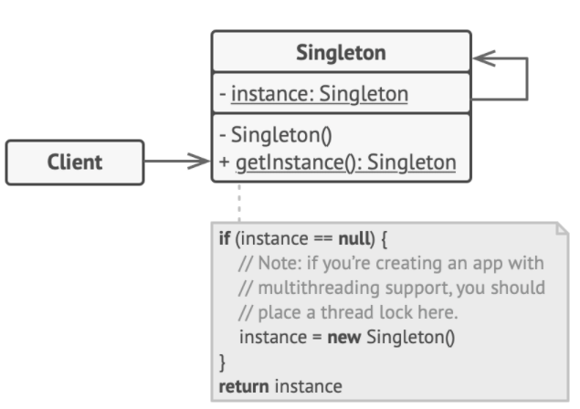

# Singleton Pattern

To create one and **only** one instance of a class that exists throughout an application's lifetime, e.g. caches, thread pools, registries.

> Singleton pattern ensures that only a single instance of a class exists and a global point of access to it exists.

## Problem

1. Ensure that a class has just a single instance

It is impossible to implement with regular constructor because a constructor call **must** always return a new object by design.

2. Provide a global access point to that instance

## Solution



1. Make the default constructor **private** of the class

So only the members of class can access the private constructor, and other objects can't use `new` operator with the class.

2. Create a static creation method that acts as a constrcutor

#### Simple Singleton

```c++
class Singleton {
protected:
    // ctor/dtor should always be private to prevent direct calling with new/delete operators
    Singleton(const std::string value) : value_(value) {}
    ~Singleton() {}
    static Singleton* singleton_;
    std::string value_;

public:
    Singleton(Singleton& other) = delete;       // Singleton shouldn't be cloneable
    void operator=(const Singleton&) = delete;  // Singleton shouldn't be assignable

    static Singleton* getInstance(const std::string& value);
    std::string getValue() {
        return value_;
    }
    void otherFunction() {}
};

Singleton* Singleton::singleton_ = nullptr;

Singleton* Singleton::getInstance(const std::string& value) {
    if (singleton_ == nullptr) {
        singleton_ = new Singleton(value);
    }
    return singleton_;
}

void thread1() {
    std::this_thread::sleep_for(std::chrono::milliseconds(1000));
    Singleton* singleton = Singleton::getInstance("one");
    std::cout << singleton->getValue() << std::endl;
}

void thread2() {
    std::this_thread::sleep_for(std::chrono::milliseconds(1000));
    Singleton* singleton = Singleton::getInstance("two");
    std::cout << singleton->getValue() << std::endl;
}

int main() {
    // if printing out same value, then the singleton was reused
    std::thread t1(thread1);
    std::thread t2(thread2);
    t1.join();
    t2.join();
    return 0;
}
```

#### Thread-safe Singleton

```c++
class Singleton {
private:
    static Singleton* pInstance_;
    static std::mutex mutex_;

protected:
    Singleton(const std::string value) : value_(value) {}
    ~Singleton() {}
    std::string value_;

public:
    Singleton(Singleton& other) = delete;       // Singleton shouldn't be cloneable
    void operator=(const Singleton&) = delete;  // Singleton shouldn't be assignable

    static Singleton* getInstance(const std::string& value);
    std::string getValue() {
        return value_;
    }
    void otherFunction() {}
};

Singleton* Singleton::pInstance_ = nullptr;
std::mutex Singleton::mutex_;

Singleton* Singleton::getInstance(const std::string& value) {
    std::lock_guard<std::mutex> lock(mutex_);
    if (pInstance_ == nullptr) {
        pInstance_ = new Singleton(value);
    }
    return pInstance_;
}
```

## Caveats

It is possible to *subclass* a singleton class by making the constructor **protected** instead of private.
+ create a **registry** of singletons of the subclasses mapped to string names
+ then use `getInstance` method which takes in *a parameter* or uses *an env variable* to return the desired singleton
