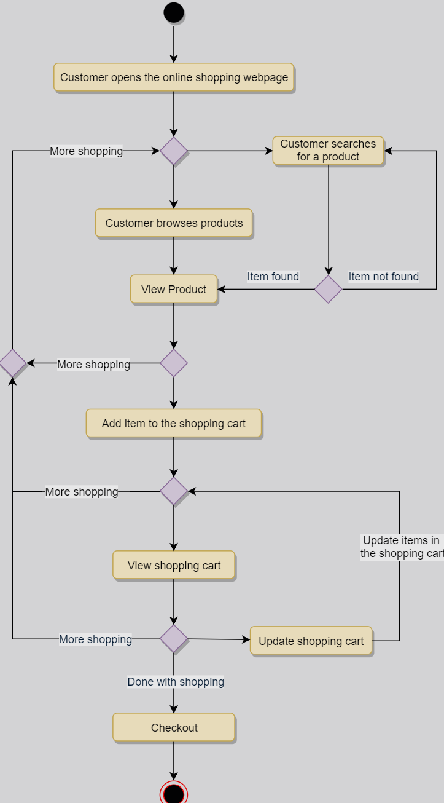

# Activity Diagram

Activity diagram illustrates the flow of control for a system **functionality**. It emphasizes the *condition of flow* and the sequence in which it happens.

Activity Diagram vs. Sequence Diagram:

| * | * | * | * |
|---|---|---|---|
| Activity diagram | flow of process             | for functional modeling | represents the flow of values from external inputs, through operations and internal data stores, to external outputs |
| Sequence diagram | interaction between objects | for dynamic modeling    | represented by tracking states, transitions between states, and the events that trigger these transitions            |

