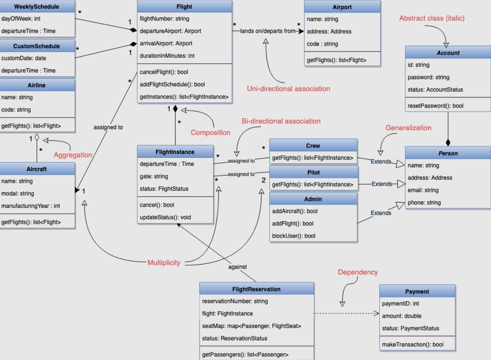
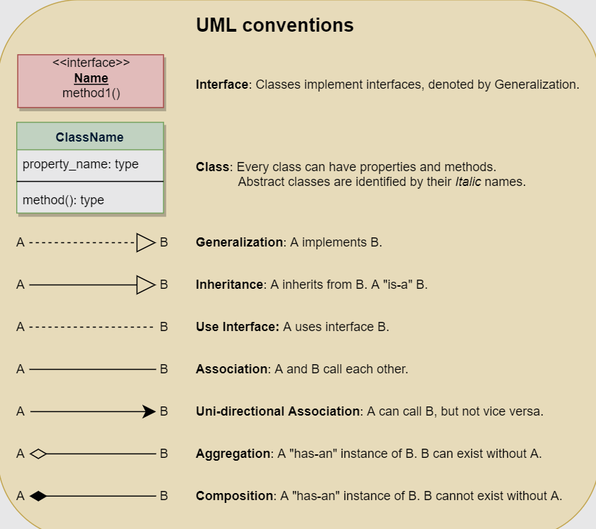

# Class Diagram

Class diagram describes the **attributes** and **methods** of a class, and also the constraints imposed on the system.

Purpose of the class diagram:
1. analysis and design of the static view of an application
2. describe the responsibilities of a system
3. provide a base for component and deployment diagram
4. forward/reverse engineering

Different types of relationships between classes:

+ **Association**
    * two classes need to communicate with each other
    * *bi-directional*, *uni-directional*

+ **Multiplicity**
    * indicates how many instances of a class participate in the relationship
    * e.g. `FlightInstance` have `2` `Pilot` instances while a `Pilot` instance can have many `*` `FlightInstance` instances

+ **Aggregation**
    * a `WHOLE` class instance has a `PART` class instance
    * but the lifecycle of `PART` instance can exist without the lifecycle of `WHOLE` instance

+ **Composition**
    * a `WHOLE` class instance has a `PART` class instance
    * but the `PART` instance gets destroyed when the lifecycle of `WHOLE` instance ends

+ **Generalization**
    * combines similar classes of objects into a single/general class

+ **Dependency**
    * one class uses/depends on another class

+ **Abstract class**
    * a class that is designed to be specifically used as a base class
    * e.g. in the C++, an abstract class contains at least one `pure virtual` function
    * the name is in *italics* in the class diagram

