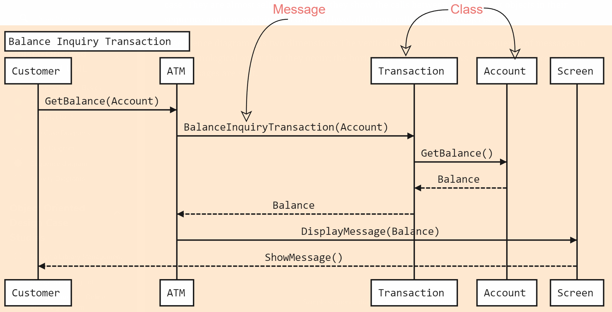

# Sequence Digram

Sequence diagram shows a detailed flow for a specific use case or just part of a particular use case.

1. describes *interactions* among classes in the *chronological order*
2. used to explore the logic of complex operations, functions or procedures

Activity Diagram vs. Sequence Diagram:

| * | * | * | * |
|---|---|---|---|
| Activity diagram | flow of process             | for functional modeling | represents the flow of values from external inputs, through operations and internal data stores, to external outputs |
| Sequence diagram | interaction between objects | for dynamic modeling    | represented by tracking states, transitions between states, and the events that trigger these transitions            |

