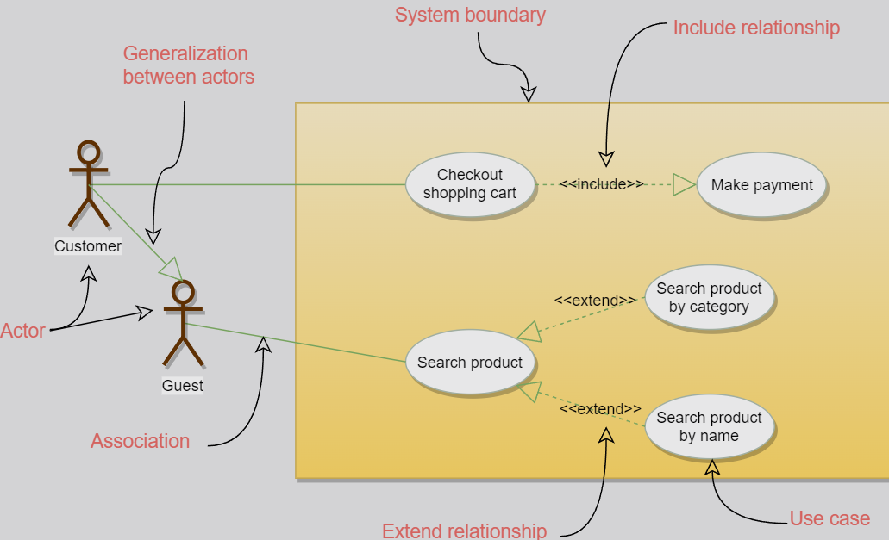

# Use Case Diagram

Use case diagram describes a set of actions (**use cases**) that a system should/can perform in collaboration with one or more external users of the system (**actors**).

1. describe the *high-level functional behavior* of the system
2. answer what system does from the *user point of view*
3. answer "what will the system do?"
4. visualize the functional requirements of a system
    + relationship of actors to the essential processes
    + relationships among different user cases

