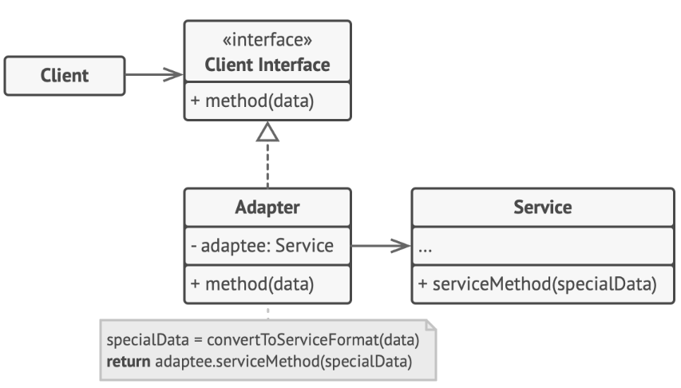
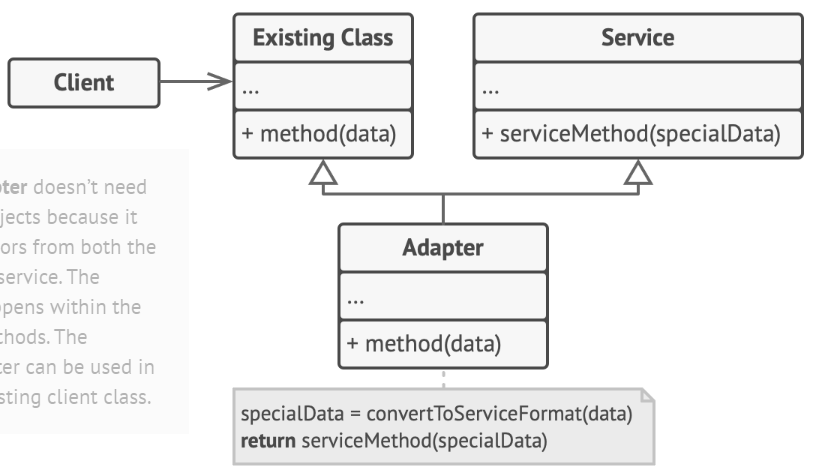

# Adapter Design Pattern

> Adapter pattern allows incompatible classes to work together by converting the interface of one class into another expected by the clients.

## Problem

## Solution

#### Object Adapter

+ Client
Contains business logic of the program.

+ Client Interface

Describes a protocol that other classes must follow to collaborate with the client code.

+ Adaptee (Service)

The useful 3rd-party/legacy class. Client code cannot use this directly because of incompatible interface.

+ Adapter
    - implements the client interface
    - wraps the service object

#### Class Adapter

+ Adapter

Inherits behaviors from both the client and the service.

## Caveats
