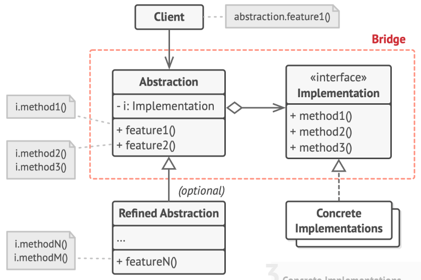

# Bridge Design Pattern

> The bridge pattern varies the abstraction independently of the implementation, thus decoupling the two in the process.

## Problem

## Solution

#### Abstraction

+ provide high-level control logic for `Client`
+ rely on the `Implementation` object to do the actual low-level work

#### Refined Abstraction (optional)

+ provide variants of control logic
+ rely on different `Implementation` methods

#### Implementation

+ declare the interface for all concrete implementations that `Abstraction` can access

#### Client

Only interested in working with the `Abstraction`.

## Caveats
