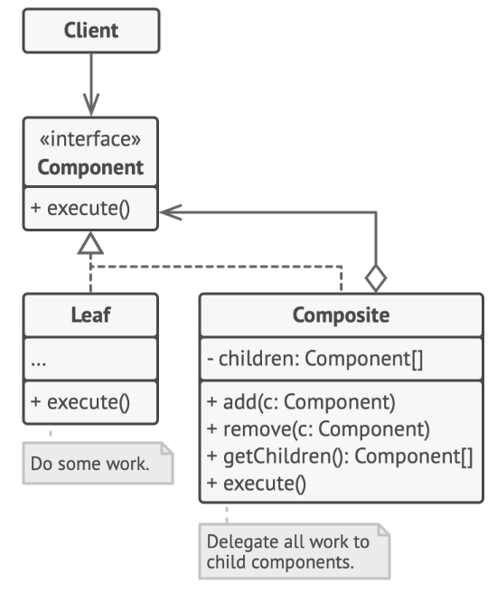

# Composite Design Pattern

> Composite pattern composes objects into tree structures to represent part-whole hierarchies, thus letting clients uniformly treat individual objects and composition objects.

## Problem

Use composite pattern when the core model of your app can be represented as a tree.

## Solution

#### Component

`Component` interface describes operations that are common to both simple/complex elements of the tree.

#### Leaf

+ Leaf is a basic element of a tree that doesn't have sub-elements
+ does most of the real work since it doesn't have anyone to delegate the work

#### Composite

+ Composite element has sub-elements: leaves/composites
+ it doesn't know concrete classes of its children, only working with all sub-elements via the `Component` interface
+ upon receiving a request, it delegates the work to its sub-elements, process intermediate results, return the final result to client

#### Client

Client works with all elements through the `Component` interface.

## Caveats
