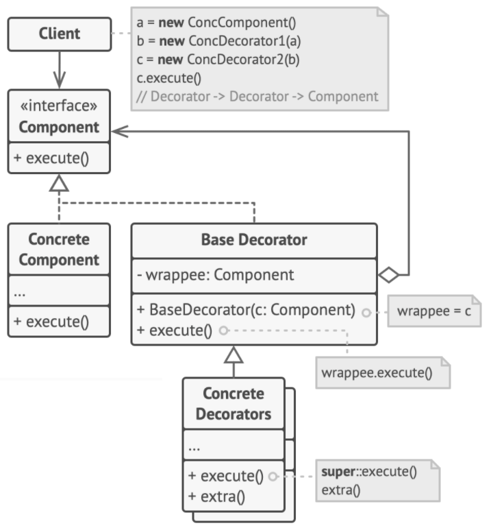

# Decorator Pattern

> Decorator method is a way to enhance or extend the behavior of an object dynamically.

Decorator pattern provides an alternative to subclassing when new functionality is desired.

## Problem

First option to extend a class is inheritance, but:
+ inheritance is static, we can't alter the behavior of an existing object at runtime
+ subclass can have only one parent class in some language

## Solution



#### Component

`Component` declares the common **interface** for both `ConcreteComponent` (wrapped objects) and `Decorator` (wrappers objects).

```c++
class Component {
public:
    virtual ~Component() {}
    virtual std::string operation() const = 0;
};
```

#### Concrete Component

`ConcreteComponent` is a class of objects being wrapped. Its behavior can be altered by decorator.

```c++
class ConcreteComponent : public Component {
public:
    std::string operation() const override {
        return "Concrete Component";
    }
};
```

#### Decorator

`Decorator` class has a reference to a wrapped object which is declared as the `Component` interface.

```c++
class Decorator : public Component {
protected:
    Component* component_;

public:
    Decorator(Component* component) : component_(component) {}

    std::string operation() const override {
        return this->component_->operation();
    }
};
```

#### Concrete Decorator

`ConcreteDecorator` defines extra behaviors that can be added to components dynamically.

```c++
class ConcreteDecorator1 : public Decorator {
public:
    ConcreteDecorator1(Component* component) : Decorator(component) {}
    std::string operation() const override {
        return "ConcreteDecorator1(" + Decorator::operation() + ")";
    }
};

class ConcreteDecorator2 : public Decorator {
public:
    ConcreteDecorator2(Component* component) : Decorator(component) {}
    std::string operation() const override {
        return "ConcreteDecorator2(" + Decorator::operation() + ")";
    }
};
```

#### Client Code

```c++
void clientCode(Component* component) {
    std::cout << component->operation() << std::endl;
}
```

#### Main

```c++
int main() {
    Component* baseComp = new ConcreteComponent();
    clientCode(baseComp); // "Concrete Component"

    Component* decorator1 = new ConcreteDecorator1(baseComp);
    Component* decorator2 = new ConcreteDecorator2(decorator1);
    clientCode(decorator2); // "ConcreteDecorator2(ConcreteDecorator1(Concrete Component))"

    delete baseComp;
    delete decorator1;
    delete decorator2;

    return 0;
}
```

## Caveats

+ We may end up with too many classes as the number of decorators grows
+ Once the concrete object is wrapped inside a decorator, the reference to the object is through the abstract type, not the concrete type anymore
