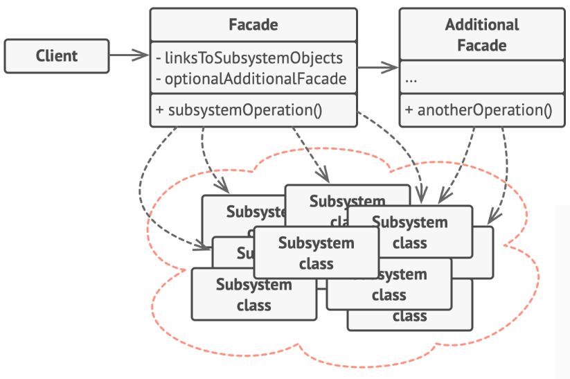

# Facade Design Pattern

> Facade pattern is a single uber interface to one or more subsystems or interfaces intending to make use of the subsystems easier/simpler.

## Problem

A situation that you must make your code work with a broad set of objects that belong to a sophisticated library of framework.

## Solution

#### Facade

+ Provide convenient access to a particular part of the subsystems's functionality
+ Know where to direct the client's request and how to operate

#### Subsystem classes

+ Various objects have complex implementations
+ Not aware of the facade's existence

#### Client

+ Use facade instead of calling the subsystem objects directly

## Caveats
