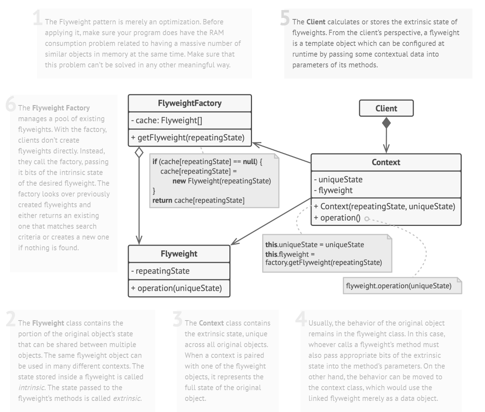

# Flyweight

> Flyweight pattern shares state among a large number of fine-grained objects for efficiency

## Problem

In a video game scene, tons of particles represented by a `Particle` object (containing `coords`, `vector`, `color`, `sprite` attributes) would take up a huge amount of RAM.

Solution is to separate the repeating/intrinsic/immutable states (`color`, `sprite`) from unique/extrinsic/mutable attributes (`coords`, `vector`).

Those extrinsic states are not stored inside the object, which should be passed by specific methods.

## Solution

