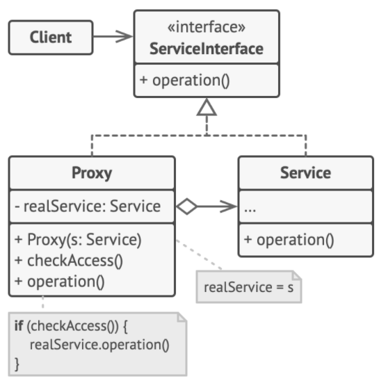

# Proxy Pattern

> Proxy pattern provides a surrogate or placeholder for another object to control access to it.

A proxy is responsible for representing another object called the **subject** in front of clients:
+ to access remote objects over the internet, running in another JVM or another address space
+ to protect a subject from clients not authorized to access it
+ to stand in place of an object that may be expensive to create and delay the object's creation till it is accessed
+ to cache queries or results from subject for clients
+ other uses cases, like firewall proxy, synchronization proxy, etc.

## Types

#### Remote Proxy

1. proxy stands in place of an object which isn't running on the same machine
2. proxy and subject implement the same interface allowing client to invoke the same methods
3. **client** doesn't know it is NOT talking to the subject but a proxy
4. **proxy** sends the request for the method invocation over the network to the remote subject
5. a **helper entity** handles the network communication on behalf of the subject
6. **subject** receives the request from the help entity and executes the method

#### Virtual Proxy

Sometimes creation of an object is expensive and complex, and should only be created when required. A virtual proxy creates objects on demand, delaying creation of its subject until required and standing in its place before/during its construction.

Example: the *loading widget* as a proxy for the picture before the picture download is complete.

#### Protection/Authorization Proxy

It controls access to the real subject. Requests are carefully examined for authorization before being forwarded to the real subject.

Example: when clients should have different access rights to the subject.

## Solution



#### Subject/Service Interface

Declare common operations for both `RealSubject` and `Proxy`.

```c++
class Subject {
public:
    virtual void request() const = 0;
};
```

#### Real Subject/Service

Contain the core business logic.

```c++
class RealSubject : public Subject {
public:
    void request() const override {
        std::cout << "RealSubject: handling the request" << std::endl;
    }
};
```

#### Proxy

```c++
class Proxy : public Subject {
private:
    // maintains a reference to an object of the RealSubject class
    RealSubject* realSubject_;

    bool checkAccess() const {
        std::cout << "Proxy: checking access before sending request" << std::endl;
        return true;
    }

public:
    // the RealSubject reference can be either lazy-loaded or passed to the Proxy by client
    Proxy(RealSubject* realSubject) : realSubject_(new RealSubject(*realSubject)) {}
    ~Proxy() {
        delete realSubject_;
    }

    void request() const override {
        if (this->checkAccess()) {
            this->realSubject_->request();
        }
    }
};
```

#### Client

Client code is supposed to work with all objects via the `Subject` interface in order to support both `RealSubject` and `Proxy` objects.

```c++
void clientCode(const Subject& subject) {
    subject.request();
}
```

#### Main

```c++
int main() {
    RealSubject* realSubject = new RealSubject();
    clientCode(*realSubject);
    Proxy* proxy = new Proxy(realSubject);
    clientCode(*proxy);

    delete realSubject;
    delete proxy;
    return 0;
}
```

## Caveats

Additional house-keeping tasks that proxy may be responsible for:
+ delete the subject
+ keep a reference count to the real subject
+ encode requests before sending them to the real subject over the wire
